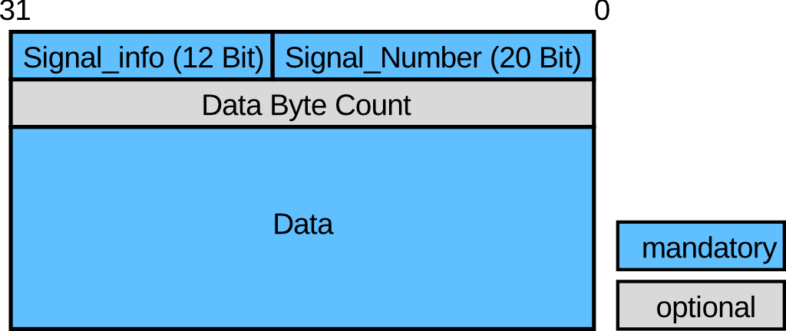
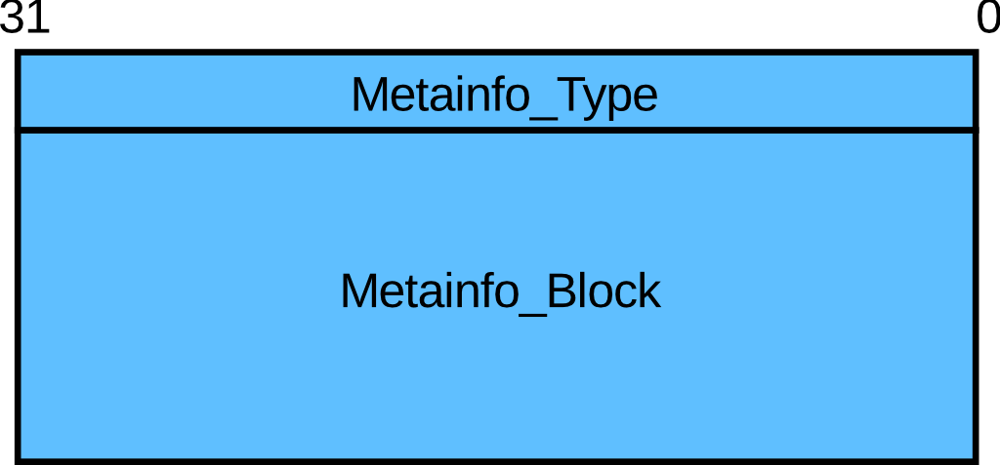
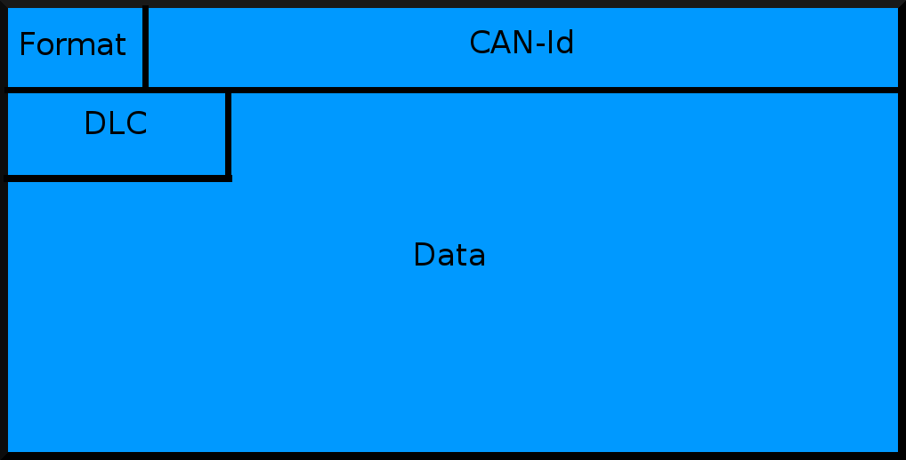

# DAQ Stream Protocol Specification, Version 1.2
## Hottinger Baldwin Messtechnik GmbH

## Scope

This document describes the DAQ Stream Protocol provided by HBM devices. 

## License

This document ist published under the terms of the [Creative Commons No
Derivative Works (CC BY-ND)](https://creativecommons.org/licenses/by-nd/4.0/).

## Overview

The data streaming mechanism is intended to enable client programs to receive 
(measurement) data from (measurement) data acquisition devices, further called devices. 
The protocol was designed with the following constraints in mind:

-   Use only one socket connection per instance of data acquisition to
    limit the number of open sockets. Multiple data acquisition instances are possible but
    devices may prevent this for performance reasons.

-   Minimize network traffic.

-   Extensible signal description and spurious event notification.

-   Transmit Meta information about the acquired signals to make the
    data acquisition self-contained. This means that it is not necessary to
    gather information via the setup interface to interpret the acquired
    signals.

## Definitions

Undefined: The Javascript values `undefined`, `null` and `NaN`

Defined: All non _undefined_ Javascript values.


## Requirements

The protocol REQUIRES the client and the device to communicate via a TCP socket
connection. Further the device MUST provide a
[JSON-RPC](http://www.jsonrpc.org/specification) over HTTP conforming service.
The client MUST be able to issue
[JSON-RPC](http://www.jsonrpc.org/specification) over HTTP Requests.

The client MUST know the IP of the device, the port of the Stream service is
fixed to 7411 (service daqstream). Intermediate devices utilizing NAT (network
address translation) might change the the number of forwarded ports. The port
number of the [JSON-RPC](http://www.jsonrpc.org/specification) service is
determined from the Command Interfaces Objects in the [Init Meta
Information](#init-meta). 
 Workflow

1) Start of Stream
    - A client MAY connect to a known Stream address (IP and port (7411)). 
      The device MAY refuse connection due to resource limits. If the device accepts
      the connection a Stream instance is created.
    - The device MUST send the [Version Meta Information](#api-version) and the
      [Init Meta Information](#init-meta) as soon as possible.
    - Among other things the Init Meta Information contains the available command interface(s).
    - After sending the [Version Meta Information](#api-version) and the
      [Init Meta Information](#init-meta) the device MAY send further [Available Meta Information](#available-meta-information) or [Optional Meta Information](#optional-features--meta-information).

2) Streaming
    - The device MAY further send [Signal Related Meta Information](#signal-related-meta-information) or
      [Optional Meta Information](#optional-features--meta-information).
    - The client MAY [subscribe](#subscribe-signal) signals at any time via 
      command interface as described in the [Init Meta Information](#init-meta).
    - Once subscribed the device confirms the operation with a 
      [Subscribe Meta Information](#subscribe-meta-information) for each signal and all relevant 
      [Signal Releated Meta Information](#signal-related-meta-information). Afterwards the device MUST 
      send the respective [Signal Data](#signal-data) as it becomes available internally and 
      MUST NOT leave out Signal Data or 
      [Signal Related Meta Information](#signal-related-meta-information). The device MAY further send
	  [Unit Meta Information](#unit).
    - Once subscribed, the client MAY [unsubscribe](#unsubscribe-signal) signals at any time via command interface.

3) End of Stream
    - The device MAY close the connection at any time if correct operation can not be continued.
    - The client MAY close the connection at any time.

### Architecture

There are three main components involved. A [transport layer](#transport-layer) and a
[presentation layer](#presentation-layer) allow the interpretation of
data send over the Stream socket by the device. [Command Interface(s)](#command-interfaces)
allow to subscribe or unsubscribe signals to a streaming instance.

## Transport Layer

The transport layer consists of a header and a variable length
block of data. The structure of the header is depicted below.



### Signal Info Field


#### Type

The `Type` sub-field allows to distinguish the type of payload, which can be either
[Signal Data](#signal-data) or [Meta Information](#meta-information):

Signal Data: 0x01

Meta Information: 0x02

#### Reserved

This field is reserved for future use and must be set to `00b`.

#### Size

Indicates the length in bytes of the data block that follows.

If `Size` equals 0x00, the length of the following data block is
determined by the (optional) `Data Byte Count` field.

### Signal Number

The `Signal Number` field indicates to which signal the following data
block belongs to. It MUST within a single device. Different
devices MAY use the same signal numbers. The `Signal Number` is required
to carry more than one single signal over a single socket connection.

`0` is the `Signal Number` reserved for [Stream Related Meta Information](#stream-related-meta-information).

### Data Byte Count

This field is only present if `Size` equals 0x00. If
so, `Data Byte Count` represents the length in byte of the data block that
follows. This 32 bit word is always transmitted in network byte order
(big endian).

## Presentation Layer

### Signal Data

The `Data` section contains signal data (measurement data acquired by the device) related to the
respective `Signal_Number`. [Meta Information](#meta-information) MAY be necessary to interpret Signal Data.

### Meta Information

The `Data` section contains additional ("Meta") information related to
the respective `Signal_Number`. Some [Signal Related
Metainformation](#signal-related-meta-information) is REQUIRED to correctly
interpret the respective [Signal Data](#signal-data). Meta Information
may also carry information about certain events which MAY happen on a
device like changes of the output rate or time resynchronization.

A Meta information block always consists of a Metainfo_Type and a Metainfo_Data block.



#### Metainfo_Type

The Metainfo_Type indicates how data in the Metainfo_Data block is
encoded. This 32 bit word is always transmitted in network byte order
(big endian).

Metainfo_Type: 0x01 The Meta data is encoded using [JSON](http://www.ietf.org/rfc/rfc4627.txt).

Meta information is always encoded in [JSON](http://www.ietf.org/rfc/rfc4627.txt). There are
[Stream Related Meta Information](#stream-related-meta-information) and
[Signal Related Meta Information](#signal-related-meta-information).

### Stream Related Meta Information

Stream related Meta information is always sent with [Signal Number](#signal-number) `= 0`
on the transport layer.

#### API Version

~~~~ {.javascript}
{
  "method": "apiVersion",
  "params": ["1.0"]
}
~~~~

This Meta information is always sent directly after connecting to the
stream socket.

#### Init Meta

The Init Meta information provides the Stream ID (required for
[subscribing signals](#command-interfaces)) and a set of
[optional features](#optional-features--meta-information) supported by the device. 
This Meta information MUST be send directly after the [Version Meta Information](#api-version).

~~~~ {.javascript}
{
  "method": "init",
  "params": {
    "streamId": <string>,
    "supported": {
      "<feature_name>": <feature_description>
      ...
    },
    "commandInterfaces": {
      "<command_interface_a>": {
        ... // service details
      },
      "<command_interface_b>": {
        ... // service details
      }
	}
  }
}
~~~~

`"streamId"`: A unique ID identifying the stream instance. It is required for
     using the [Command Interface](#command-interfaces).

`"supported"`: An Object which holds all [optional features](#optional-features--meta-information)
     supported by the device. If no optional features are supported, this object MAY be empty.
     The "supported" field's keys always refer to the respective optional feature name. 
     E.g. the key "alive" refers to the
     [Alive Meta Information](#alive-meta-information). The field's value MUST
     comply to the respective Feature Value description.

`"commandInterfaces"`: An Object which MUST hold at least one command interface (descriptions)
     provided by the device. A command interface is required to
     [subscribe](#subscribe-signal) or [unsubscribe](#unsubscribe-signal) a signal. 
     The key `<command_interface>` MUST be a String which specifies the name of
     the [command interface](#command-interfaces). The associated Object value
     describes the command interface in further detail.


#### Error

~~~~ {.javascript}
{
  "method": "error",
  "params": {
      "code": <number>,
      "message": <string>,
      "data": <anything>
    }
}
~~~~

This Meta information is always sent on errors.


`"code"`: A Number that indicates the error type that occurred. This MUST be an integer.

`"message"`: A String providing a short description of the error.

`"data"`: A Primitive or Structured value that contains additional information about the error. This may be omitted.


#### Available Meta Information

~~~~ {.javascript}
{
  "method": "available",
  "params": [<string>,...]
}
~~~~

`"params"`: An array of strings describing unique signal IDs.


The signal specified SHOULD be available to be [subscribed](#subscribe-signal).
[Subscribing](#subscribe-signal) the signal id provided MAY fail, even if the 
respective [Unavailable Meta information](#unavailable-meta-information) has not arrived yet.

#### Unavailable Meta Information

~~~~ {.javascript}
{
  "method": "unavailable"
  "params": [<string>,...]
}
~~~~

`"params"`: An array of strings describing unique signal IDs.

### Signal Related Meta Information

The signal specified SHOULD not be available to [subscribe](#subscribe-signal) before
the next [Available Meta information](#available-meta-information) arrives.

#### Subscribe Meta Information

~~~~ {.javascript}
{
  "method": "subscribe",
  "params": [<string>]
}
~~~~

`"params"`: An array containing one element with the signal ID of the subscribed signal.


The string value of the subscribe key always carries the unique signal
ID of the signal. It constitutes the link between the signal ID and the
[Signal Number](#signal-number) used on the transport layer. This Meta
information is emitted on behalf of a [Subscribe signal](#subscribe-signal)
command. When subscribing n signals with one subscribe command, n subscribe Meta 
Information messages are to be received.

Because this Meta information is an acknowledge to a [Subscribe
signal](#subscribe-signal) it SHOULD be send as soon as possible and MUST be send 
before any other [Signal Data](#signal-data) or [Meta Information](#meta-information) 
with the same `Signal_Number`.

#### Unsubscribe Meta Information

~~~~ {.javascript}
{
  "method": "unsubscribe"
}
~~~~

The unsubscribe Meta information indicates that there will be send no more
[Signal Data](#signal-data) or [Meta-Information](#meta-information) with the same 
`Signal_Number` upon next [subscribe](#subscribe-signal). 
This Meta information is emitted on behalf of an [Unsubscribe signal](#unsubscribe-signal) command. 
Because this Meta information is an acknowledge to an [Unsubscribe signal](#unsubscribe-signal), it SHOULD be send as soon as possible.
No more [Signal Data](#signal-data) or [Meta Information](#meta-information) with the same `Signal_Number` MUST be sent after the unsubscribe acknowledgement.

#### Time Meta Information

~~~~ {.javascript}
{
  "method": "time",
  "params": {
    "stamp": <time_object>,
    "scale": <string>, // optional, e.g. UTC, TAI, GPS
    "epoch": <string> // optional
  }
}
~~~~


`"stamp"`: A [Time object](#time-objects), e.g. ntp.

`"scale"`: An optional string describing the time scale, e.g. UTC, TAI, GPS.

`"epoch"`: An optional string that carries information about the epoch of the
     stamp key. This key is necessary if an absolute time is delivered. 
     The format of the epoch string MUST stick to ISO 8601:2004:
     YYYY-MM-DDThh:mm:ss.f
 
The `time` Meta information is always sent before the first measurement
sample is transmitted or in case of a time resynchronization. The time
stamp sub object always carries the timestamp corresponding to the
first sample that follows.

#### Signal Rate

~~~~ {.javascript}
{
  "method": "signalRate",
  "params": {
    "samples": <number>,
    "delta": <time_object>
  }
}
~~~~

`"samples"`: The number of measurement values the "delta" key refers to.

`"delta"`: A relative [Time object](#time-objects) (without "scale" and "epoch" key) 
     describing the time delta between samples
     measurement values.


Asynchronous signals have no signal rates. Therefore, signal rate Meta
information is never send for asynchronous signals.

For synchronous signals, the signal rate Meta information must be sent
before the first measurement value is transmitted.

#### Data

This Meta information describes how the [Signal Data](#signal-data) in
the [Transport Layer](#transport-layer) must be interpreted.

~~~~ {.javascript}
{
  "method": "data",
  "params" : {
    "pattern": <string>,
    "endian": <string>,
    "valueType": <string>,
    "timeStamp": { // only emitted for patterns with time stamp
      "type": <string>,
      "size": <number> // timestamp size in byte
    }
    "time": { // deprecated, shall never be used by client software
    }
  }
}
~~~~


-`"pattern"`: Describes the data pattern of [Signal Data](#signal-data), either

  - "V"; No timestamps, values only. This pattern is used only for synchronous values.
  - "TV"; One timestamp per value, first comes the timestamp, then the value. This pattern is used for asynrchonous values.
  - "TB"; One timestamp per signal block. The timestamp corresponds to the first sample in the signal block.
  - "TXAV"; Timestamp, First absolute $x$ coordinate $x_0$ followed by 
  an array of values $y_0, y_1.. y_n$ equidistant in dimension $x$.   
  Before sending any data the `patternDetails` meta information has to be send once. 
  - "TAP"; Timestamp, array of points.
  Before sending any data the `patternDetails` meta information has to be send once.
  
-`"endian"`: Describes the byte endianess of the [Signal Data](#signal-data) and timestamps, either

  - "big"; Big endian byte order (network byte order).
  - "little"; Little endian byte order.


-`"valueType"`: Describes the data type of the [Signal Data](#signal-data), either

  - "u32"; unsigned int 32 bit
  - "s32"; signed int 32 bit
  - "u64"; unsigned int 64 bit
  - "s64"; signed int 64 bit
  - "real32"; IEEE754 float single precision
  - "real64"; IEEE754 float double precision
  - "canRaw";
    


	  "**Format (3bit)**":
	  format of the can identifier (Bit 31 = 0: 11 bit, Bit 31 = 1: 29 Bit).

	  "**CAN-Id (29bit)**":
	  can identifier

	  "**DLC (8bit)**":
	  number of bytes in the data block

	  "**Data**":
	  data block of the can message
	  


-`"timeStamp"`: Describes the format of a timestamp, if timestamps are delivered
 (only if "pattern" is either "TV" or "TB"). Please note the special
 handling of [8 byte timestamps in "ntp" format](#ntp).
	
#### Pattern Details

##### Equidistant two dimensional Array

Equidistant two dimensional arrays carry several values in another dimension (domain) $x$ but time, like frequency. 


Points are described by an absolute start value $x_0$ for the $x$ coordinate of the first point and a relative $delta$ for the $x$ coordinate between two points.
Both dimensions have the same `valueType` as described in the `data` meta inforation.

~~~~ {.javascript}
{
  "method": "patternDetails",
  "params" : {
    "xDelta": <number>,
    "xMin" : <number>,
    "xMax" : <number>,
    "xUnit": <string>,
    "yUnit": <string>
  }
}
~~~~

- xDelta: Increment of $x$ coordinate between each array value
- xMin: Minimum of value range of $x$ coordinate (Optional parameter)
- xMax: Maxmum of value range of $x$ coordinate (Optional parameter)
- xUnit: Unit of the $x$ coordinate
- yUnit: Unit of the $y$ coordinate

##### Array of Points


Each point has an absolute coordinate for each dimension
All dimensions have the same `valueType` as described in the `data` meta inforation.

~~~~ {.javascript}
{
  "method": "patternDetails",
  "params" : {
    "dimensions": [
      {
        "unit": <string>,
        "min" : <number>,
        "max" : <number>        
      }
    ]
  }
}
~~~~

- dimensions: Array containing objects, describing each dimension. The 
  number of elements in the array equals the number of dimensions of each point.
- unit: Unit of the dimension
- min: Minimum of value range of the dimension (Optional parameter)
- max: Maxmum of value range of the dimension (Optional parameter)


#### Unit

This meta information is available for the patterns  `V`, `TV`, `TB`.

~~~~ {.javascript}
{
  "method": "unit",
  "params": {
    "unit": <string>
  }
}
~~~~

`"unit"`: A UTF-8 encoded string containing the unit describing the signal.


#### Time Objects

Some Meta information carries information about time. It follows a section that
does not describe complete Meta information but
[JSON](http://www.ietf.org/rfc/rfc4627.txt) sub objects that characterize time
objects. The definition of other time objects in addition to NTP is encouraged.
Time Objects MUST provide a key named `type` to allow reacting programatically
to different Time Objects.

##### NTP

The NTP timestamp format is specified as follows:

~~~~ {.javascript}
{
  "type": "ntp",
  "era": <number>,
  "seconds": <number>,
  "fraction": <number>,
  "subFraction": <number>
}
~~~~

All numbers have to be interpreted as 32 bit unsigned integers. The format
adheres to the "NTP Date Format" specified in [RFC
5905](http://tools.ietf.org/html/rfc5905) (if you combine "fraction" and
"subFraction" into the single 64-Bit "fraction" of NTP date stamp).

Please note that it is allowed to truncate the 16 byte NTP timestamp to
8 bytes. This truncation is necessary to keep the timestamp overhead
under control especially if one timestamp per value is sent (pattern
"TV"). The "timeStamp" sub-object of the [data meta object](#data)
typically specifies only 8 byte timestamps. 

The 16 byte ntp timestamp is truncated to 8 bytes by omission of the era
and subFraction field.


## Command Interfaces

A command interface MUST provide means to subscribe and unsubscribe signals to
a stream instance. To issue any stream related commands, the streamId is
required, which MUST be read from the stream data as part of the [Init
Meta](#init-meta). Thus a connection to the Stream port must have been
established [previously](#workflow). Each Command Interface specifies the
[JSON](http://www.ietf.org/rfc/rfc4627.txt) Command Interface Object contained
in the [Init Meta Information's `commandInterfaces` Object](#init-meta).

### [JSON-RPC](http://www.jsonrpc.org/specification) over HTTP Command Interface

The [JSON-RPC](http://www.jsonrpc.org/specification) Command Interface conforms
to the [JSON-RPC 2.0](http://www.jsonrpc.org/specification) over HTTP
specification.

#### [JSON-RPC](http://www.jsonrpc.org/specification) Command Interface Init Object

The key inside the [Init Meta Information's `commandInterfaces`](#init-meta) is:

    "jsonrpc-http"

The description MUST be as follows:

```javascript
...
"commandInterfaces": {
  "jsonrpc-http": {
    "port": <service_name_or_port_number>,
    "apiVersion": 1,
    "httpMethod": <http_method>,
    "httpVersion": <http_method>,
    "httpPath": <http_path>
  }
}
```

`"httpMethod"`: The HTTP Method to use (e.g. POST)

`"httpPath"`: The HTTP URI / path of the [JSON-RPC](http://www.jsonrpc.org/specification) service.

`"httpVersion"`: The HTTP Version the device supports, either "1.0" or "1.1".

`"port"`: Specifies the port via either a String denoting a service name or a Number. The service
     name implies a port (e.g. via device scan).
     
#### Example of an http post
Following is a simple example of an http 1.0 post. We do use http version 
1.0 in order to keep the protocol as simple as possible.
http 1.0 works in the following way: For every post, a new connection to the http server, on the port as metioned by the received command interface, is to be opened. 
The request is send to the server. The server does process the request and sends a response. After sending the complete response, the server closes the connection.
As a result the requesting client does not need a length information of the response. It simply receives everything until the connection is closed.

```http
POST <http_path> HTTP/1.0
Host: <address_of_the_destination>
Accept: */*
Content-Type: application/json; charset=utf-8
Content-Length: <length of following content>

<content>
```


* HTTP specifies carriage return line feed as line termination
* Do not forget the empty line between header and content. It marks the end of the header.
* Content equals the json rpc request as defined in this specification.
* The final line termination after the content is also required.

The device will send a response in the following form:

```http
HTTP/1.0 200 OK
Date: Mon, 28 Sep 2015 08:36:35 GMT
Content-Type: application/json
Server: <name_of_the_server i.e.>
Access-Control-Allow-Origin: *
Content-Length: 20

<content>
```

* The same rules as for requests do apply here
* Content equals the json rpc response to the request

#### Subscribe Signal

##### Request

~~~~ {.javascript}
{
  "jsonrpc": "2.0",
  "method": "<stream_id>.subscribe",
  "params": [<string>,...],
  "id": <number_or_string>
}
~~~~

`"params"`: An array of strings describing unique signal IDs.

Subscribes signal IDs to the stream specified int the method name.
All signal ids subscribed successfully appear as a 
[subscribe Meta information](#subscribe-meta-information) in the associated
Stream. Even if the signal IDs provided are [available](#available-meta-information), this call MAY fail. 

##### Response

In case all specified signal ids have been subscribed, the following
response MUST be send:

~~~~ {.javascript}
{
  "jsonrpc": "2.0",
  "result": <defined>,
  "id": <number_or_string>
}
~~~~

In case the request `<stream_id>` was invalid the following message is
returned:

~~~~ {.javascript}
{
  "jsonrpc": "2.0",
  "error":{
  	"message":"Method not found",
	"code":-32601
  },
  "id": <number_or_string>
}
~~~~

In case one or more signal ids have not been subscribed, an error is
returned. The error`s data field denotes the signal ids which not have
been subscribed:

~~~~ {.javascript}
{
  "jsonrpc": "2.0",
  "error": {
    "message": "Invalid params",
    "code": -32602,
    "data": [<string>,...]
  },
  "id": <number_or_string>
}
~~~~

`"data"`: An array of strings of signal IDs for which the subscribe failed.

#### Unsubscribe Signal

##### Request

~~~~ {.javascript}
{
  "jsonrpc": "2.0",
  "method": "<stream_id>.unsubscribe",
  "params": [<string>,...],
  "id": <number_or_string>
}
~~~~

`"params"`: An array of strings describing unique signal IDs.

Unsubscribes signal IDs from the stream specified in the method name. All
signal ids unsubscribed successfully appear as a [unsubscribe Meta
information](#unsubscribe-meta-information) in the associated Stream. Params must be an
array of strings.

##### Response

The following message is transmitted if the unsubscription is successful:

~~~~ {.javascript}
{
  "jsonrpc": "2.0",
  "result": <defined>,
  "id": <number_or_string>
}
~~~~

In case the request `<stream_id>` was invalid the following message is
returned:

~~~~ {.javascript}
{
  "jsonrpc": "2.0",
  "error": {
  	"message":" Method not found",
	"code": -32601
  },
  "id": <number_or_string>
}
~~~~

In case one or more signal ids have not been unsubscribed, an error is
returned. The error`s data field denotes the signal ids which not have
been unsubscribed:

~~~~ {.javascript}
{
  "jsonrpc": "2.0",
  "error": {
    "message": "Invalid params",
    "code": -32602,
    "data": [<string>, ...]
  },
  "id": <number_or_string>
}
~~~~

`"data"`: An array of strings of signal IDs for which the unsubscribe failed.

## Optional Features / Meta Information

All optional features supported by the device MUST be specified in the
[Init Meta information`s](#init-meta) "supported" field with a value according to the 
respective optional Feature Value Description.

### Connect Meta Information

Indicates that a function block in the signal chain of a subscribed
signal was connected.

~~~~ {.javascript}
{
  "method": "connect",
  "params": [<string>,...]
}
~~~~

`"params"`: Array of unique signal IDs of the signals that were connected.

#### Connect Feature Value

If this feature is supported, the [Init Meta information`s](#init-meta) "supported" field, 
MUST have a field named "connect" with this value:

~~~~ {.javascript}
true
~~~~

### Disconnect Meta Information

Indicates that a function block in the signal chain of a subscribed
signal was disconnected.

~~~~ {.javascript}
{
  "method": "disconnect",
  "params": [<string>,...]
}
~~~~

`"params"`: Array of unique signal IDs of the signals that where disconnected.

#### Disconnect Feature Value

If this feature is supported, the [Init Meta information`s](#init-meta) "supported" field, 
MUST have a field named "disconnect" with this value:

~~~~ {.javascript}
true
~~~~

### Time Meta Information

~~~~ {.javascript}
{
  "method": "time",
  "params": {
    "stamp": <time_object>,
    "scale": <string>, // optional, e.g. UTC, TAI, GPS
    "epoch": <string> // optional
  }
}
~~~~

`"stamp"`: A [Time Object](#time-objects) that carries the internal time of the device.
     This time has only a weak relation to timestamps for measurement
     signals and must not be used to align the measurement values. Due to signal
     runtime, signals may carry timestamps older than `time`. This is a stream related
     Meta Information and thus has `Signal_Number=0`.

#### Time Feature Value

If this feature is supported, the [Init Meta information`s](#init-meta) "supported" field, 
MUST have a field named "time" with this value:

~~~~ {.javascript}
true
~~~~

### Alive Meta Information

Is send periodically to confirm the device`s stream infrastructure is still alive.

~~~~ {.javascript}
{
  "method": "alive"
}
~~~~

#### Alive Feature Value

If this feature is supported, the [Init Meta information`s](#init-meta) "supported" field, 
MUST have a field named "alive" with this value:

~~~~ {.javascript}
  <number>
~~~~

The `number` specifies the period of time (in seconds) to elapse without
receiving an Alive Meta information before the device SHOULD be considered "lost".

### Ringbuffer Fill Level

Is send at will. The value of `fill` is a number
between 0 and 100 which indicates the stream`s associated data buffer
fill level. A fill value of 0 means the buffer is empty. A fill value of 100
means the buffer is full and the associated stream (and the associated
socket) will be closed as soon as all previously acquired data has been
send. This meta information is for monitoring purposes only and it is
not guaranteed to get a fill = 100 before buffer overrun.

#### Fill Meta Information

~~~~ {.javascript}
{
  "method": "fill",
  "params": [38]
}
~~~~

#### Fill Feature Object

If this feature is supported, the [Init Meta information`s](#init-meta)
"supported" field must have an entry named "fill" with this value:

~~~~ {.javascript}
true
~~~~

## Changes

### Version 1.2

Added patterns "TXAV" and "TAP"


## Glossary

JSON: JavaScript Object Notation
<http://www.ietf.org/rfc/rfc4627.txt>

JSON-RPC: JavaScript Object Notation Remote Procedure Call
<http://www.jsonrpc.org/specification>
